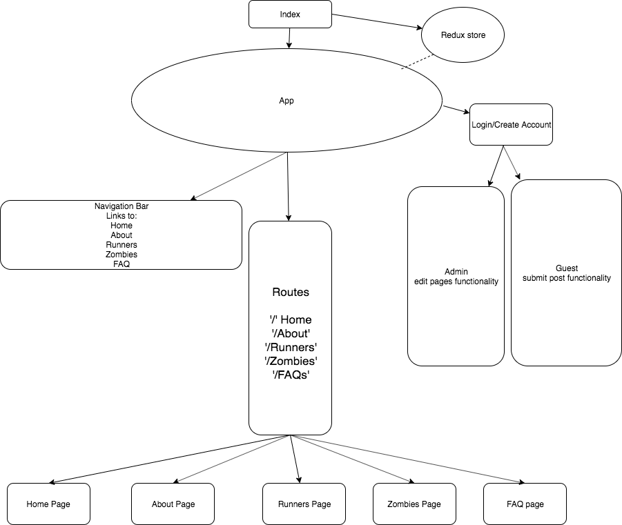

## ZombieFest redesign
The goal is to replicate and improve the styling of the old site while improving performance metrics, provide hosting, authentication, and file storage. Authorized users will be able to change basic web layout, and upload photos and articles, regular users will be able to participate in commenting on photos and articles. 

### `Purpose`
- To create a new website for the Lake Jackson ZombieFest 5K. [Link to original site](https://zombiefest.org/)

- New site will have improved aesthetics, responsiveness, performance, and an admin feature that gives administrators interface to change basic website layout without programming. [Link to new site](https://zombiefestlj.firebaseapp.com/)
### `Technologies Used`
- UI created with React, Material-UI
- State handled with React-Redux, Authentication, Hosting, and Data backend handled with Firebase

### `stretch-goals`
- Zombie animations, run from zombie game, run from zombie load animation

## Component Tree

